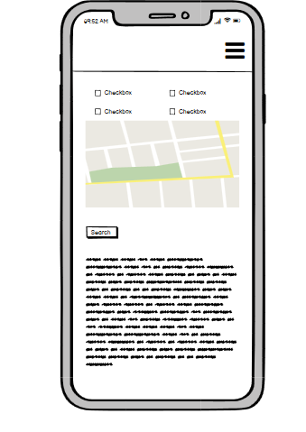

## Introduction 

## UX

#### Strategy - Project Goal

Discover Romania is travel agent website that can book your favorite tour. Its purpose is to promote National Heritage and to convince visitors to book tours directly throught the website and allow a nice and smooth navigation through the website and a natural flow of information.

#### Scope - Members Goal 

Is to be able to find the necesary information about the services provided and also to be able to navigate the website easely.

#### Members Goal:

* be able to navigate the website 
* easy to understand where i am on the website 
* have alternatives to select from 
* inspiring or usefull content 
* easy booking process 
* have informations to fallow

#### Business Goals
* Promote the country's heritage 
* provide a positive experience 
* easy access and user friendly 
* simple and easy to visualise 
* obtain guest details 

### User Stories

#### As a customer visiting the website I would like to:

* easy acces to the information 
* understand how to navigate 
* visualy pleasing 
* details and pricing list 

#### As a developer my goals are to:

* Create a modern and easy to navigate webpage
* Easy to understand the webpage
* Provide the customers with relevant information
* Ensure that website is suitable for all users including impared user

#### Returned customer

* have more tours to chose from  
* different types of tours ie, fun,religious,sports,sea, montain
* option to book with date to enter the date details 
* age friendly 

#### Structure
The Structure of the website is a sigle page diveded in multiple sections such as:
* Home displaying the the slideshow, 
* About which contains a short description
* Castles contains a selection of castles with short description and API Map
* Monasteries contains a selection of monastery  with short description and API Map
* Book Your Tour which contains a form were when filld sends the website admi an email with the details.

#### Design Coice

 Both the navigaton and the footer have same colour (#f8f9fa), decided to keep it plain and simple with a white background.

 Favicon logo uses the initials of DR from (Discover Romania).Used a size of 32x32 with black writing with a font-family Leckerli One of and #f8f9fa colour to blend in with the website design 

 Google Fonts - Home button uses font-family Leckerli One while the other buttons and content uses the Roboto font-family.

 Icons - Used fontawsome to cater for the footer and add the social media icons

 Colours 

 - Main home navigation button - black
       
 - navigation buttons #767676
       
 - background color - white
 
 - text - black
 
 - form - #767676
 
 - submit button background #f8f9fa 
 
 - footer color #f8f9fa

 - fontawsome icons used font-size xxlarge and background color black  

#### Skeleton - Wireframes 

The webpage is made out of four main categories Aout, Castles, Monasteries and Book Your Tour. Bellow it will be displayed the frams for three different types of screen sizes.

Mobile: 

       

       
Tablet: 

PC:     

       

       

       

## Features 

1. Existing features

* Navigation Bar suported on all types of electronic devices 
* Dropdown buttons that extend the lenght of the webpage and display images and google maps via API 
* Forms that are fully functionable and send emails to the adim via sendEmail.js

2. Features can be Implemented / Improved

* Add more and a bigger sellection range of tours 
* Implement more inputs to the form such as date, phone number and more options
* Implement better visual design 
* Add a dropdown button in the form with a selection of tours rother than to enter tour name 

## Technology Used 
* Used Bootstrap v4.3- https://getbootstrap.com/docs/4.3/getting-started/introduction/
* Used Incognito Lighthouse in Google Chrome for Testing
* Used to obtain mock-ups for the website http://ami.responsivedesign.is/#
* Used for General Knowladge and also to validate html & CSS https://www.w3schools.com/
* Used for General Knowladge https://www.youtube.com/
* Used for General Knowladge https://learn.codeinstitute.net/ci_program/diplomainsoftwaredevelopment
* Used sendEmail.js https://dashboard.emailjs.com/admin/templates
* Used to validate java script https://jshint.com/
* Used www.favicon.io to obtain the logo 
* Used GOOGLE for fonts and API 
* Used Fontawsome for icons https://fontawesome.com/v5.15/icons?d=gallery&p=2&m=free
* Used Balsamiq for wireframes
* Used Youtube for general knowladge https://www.youtube.com/

## Deployment

#### Setting the Repository from Private to Public 
* Log in to GitHub
* Click Repositories
* Sellect correct Repository (MS2-Project-)
* Click - Sttings 
* Scroll to the bottom page 
* Click on make page Public
* Type in the requierment and Save

#### Setting the Repository from None to Master 
* Log in to GitHub
* Click Repositories
* Sellect correct Repository (MS2-Project-)
* Click - Sttings 
* Go to and click on Page on bottom left side 
* Sellect the source from None to Master and then save 
* After you save you will be provided with a link ( https://slabyg.github.io/MS2-Project-/ )

## Credits
1. Content 

About -intro- Romania is a southeastern European country known for the forested region of Transylvania, ringed by the Carpathian Mountains. Its preserved medieval towns include Sighişoara, and there are many fortified churches and castles, notably clifftop Bran Castle, long associated with the Dracula legend. Bucharest, the country’s capital, is the site of the gigantic, Communist-era Palatul Parlamentului government building – content taken from https://www.google.com/search?q=about+romania&spell=1&sa=X&ved=2ahUKEwicm-6H-KrxAhU7QkEAHYaJDTIQBSgAegQIARAw&biw=1920&bih=969

Info castles “Romania's collection of castles and fortresses perhaps best illustrates the rich medieval heritage of the country. While castles built from the 14th to the 18th centuries are strong and austere fortresses built mainly for defense against invaders, those erected beginning in the late 1800s are imposing and luxurious. The most popular include the 14th century Corvin Castle, built on the site of a former Roman camp, the elegant 19th century Peles Castle with its 160 rooms filled with priceless European art and, of course, the Bran Castle, built in the mid-1300s and legendary home to Bram Stoker's Count Dracula. ” content taken from http://romaniatourism.com/castles-fortresses.html

“Corvin Castle, also known as Hunedoara Castle, is a Gothic-Renaissance castle in Hunedoara, Romania. It is one of the largest castles in Europe and figures in lists of the Seven Wonders of Romania” content taken from (https://en.wikipedia.org/wiki/Corvin_Castle)

“Bran Castle It is a national monument and landmark in Transylvania. The fortress is on the Transylvanian side of the historical border with Wallachia. Commonly known outside Transylvania as Dracula's Castle” content taken from (https://en.wikipedia.org/wiki/Bran_Castle)

“Peleș Castle  is a Neo-Renaissance castle in the Carpathian Mountains, near Sinaia, in Prahova County, Romania, on an existing medieval route linking Transylvania and Wallachia. It was constructed for King Carol I.”content taken from (https://en.wikipedia.org/wiki/Pele%C8%99_Castle)

Info monasteries- “During the invasions of migratory populations (barbarians), people found their shelter in front of the invaders, behind the fortified walls of the Monasteries, in the forests or caves surrounding the hermitages inhabited by the hermit monks. In order to celebrate important victories in battles, the Wallachian or Moldavian voivodes raised monasteries. In this way, the famous medieval monastery chain from Moldova and Bucovina was born. These monasteries, today under protection of UNESCO heritage, are known to be the oldest and best preserved Orthodox monasteries still in use!” content taken from - https://infocarpathia.com/the-faith-of-the-romanian-people/?gclid=Cj0KCQjw_dWGBhDAARIsAMcYuJyJIoa4ZAPVzgEcFfDKOVuNJi81ioNPB72tBOcOU0BxvSY-Wu5ZdQgaAuo5EALw_wcB

“The Voroneț Monastery is a medieval monastery in the Romanian village of Voroneț, now a part of the town Gura Humorului. It is one of the famous painted monasteries from southern Bukovina, in Suceava County” content taken from https://en.wikipedia.org/wiki/Vorone%C8%9B_Monastery

“Sucevița Monastery is an Eastern Orthodox convent situated in the Northeastern part of Romania. It is situated near the Suceviţa River, in the village Sucevița, 18 km away from the city of Rădăuţi, Suceava County. It is located in the southern part of the historical region of Bukovina”
content taken from https://en.wikipedia.org/wiki/Sucevi%C8%9Ba_Monastery

“The Putna monastery is a Romanian Orthodox monastery, one of the most important cultural, religious and artistic centers established in medieval Moldavia; as with many others, it was built and dedicated by Stephen the Great.” content taken from https://en.wikipedia.org/wiki/Putna_Monastery

2. Media

Corvin - Blogul Travelminit.ro - https://blog.travelminit.ro/viziteaza-castelul-corvinilor-castelul-preferat-al-turistilor-anul-2017/ -unknown license 

Bran - https://www.touropia.com/regions-in-romania-map/ -commercial and other license

Peles - Camil Iamandescu - https://ro.wikipedia.org/wiki/Fi%C8%99ier:Camil_Iamandescu-Castelul_Peles.jpg- free to use and share licence.

Voronet - https://commons.wikimedia.org/wiki/File:RO_SV_Biserica_m%C4%83n%C4%83stirii_Vorone%C8%9B.JPG - Creative Commons Licences

Sucevita - https://commons.wikimedia.org/wiki/File:Biserica_si_curtea_manastirii_Sucevita.jpg - Creative Commons Licences

Putna - https://commons.wikimedia.org/wiki/File:%22M%C4%83n%C4%83stirea_Putna%22.JPG - Creative Commons Licences

3. Code 

Navigation - bar used bootstrap ad adjusted the navigation 

Slideshow - used bootstrap to display the slidehow (initialy i wanted to minimise the height of the slideshow however that was cutting the picture and wasnt loking nice at at so i left it at its original size. did atempt to change it no success yet)

Dropdown - used bootstrap for dorpdown buttons on the main page under section Castles & Monasteries

CSS - class="box" was taken from stock overflow and used in order to aling both the text(div) and map hence the error in the validator link from stock overflow was lost by mistake

Forms - Tutor Sean from Code Institute commented the original Forms added by myself and added new ones similar as my

sendEmail.js -  Tutor Sean from Code Institute commented the original codes and added his own codes. Original codes are commented out

4. Acknowledge

Eventyret_mentor from CI was very helpfull giving advise and tips through the slack channel

Sean from Tutor Support CI very patient and has the skill to teach others and make them understand things like java script

Anthony O' Brien very helpfull providing me with examples and explanations on slack 

Jo from Tutor Support CI was very helpfull giving advise 

CI for use of tutor support line 

My mentor Victor for helping out with ideas and sugestions 